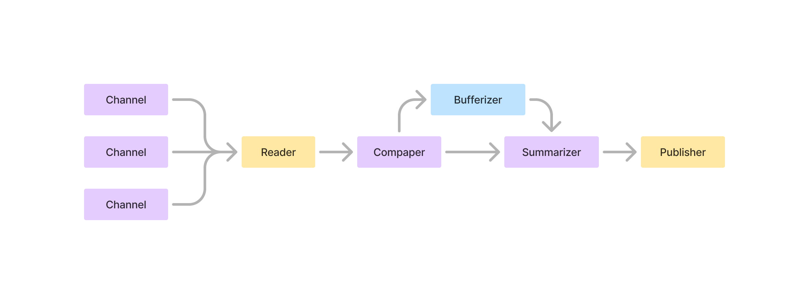

# Telegram-News-Aggregator

## Overview

Telegram News Aggregator is an application builded using ASP.Net Core 8 which provides you a great tool to optimize your news flow and get all news immediatly and without dublicates.

## How does it works?

There is a pool of telegram channels, which are origins of news. Reader service reads messages coming from this channels and pushes next to save it and extract tags (not listed on sheme). Tags are used to compare messages between each other and combine dublicates.

Message comparer compares message to existed news which were not summarized. If there are no similar messages, it creates new block and push it to buffer.

Summarizer reqularly cheks blocks and messages. It summarize block if it has maximum available messages count or if it exists too long, and summarize single message if it was sended a long time ago.

When summary was created, publisher sends it using Telegram bot. Only users who choosed to receive updates from this channel will receive summary.

## Contribution

Thanks for [@WWWcool](https://github.com/WWWcool) for his help!